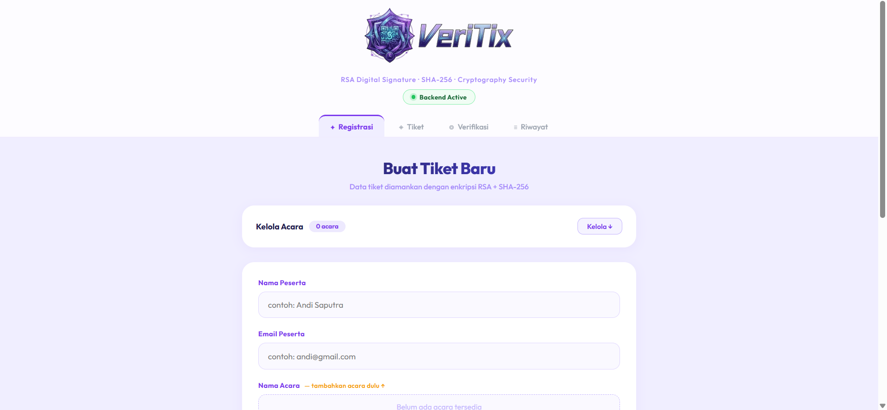
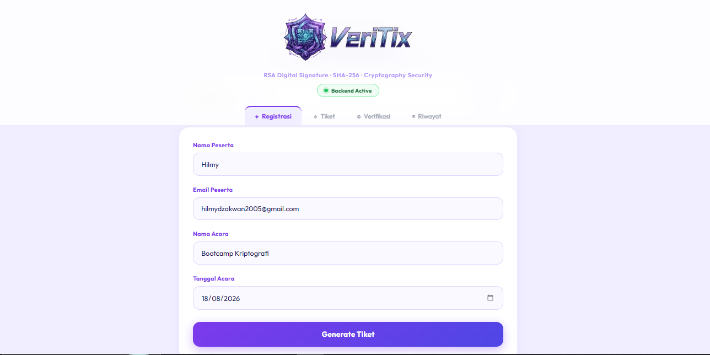
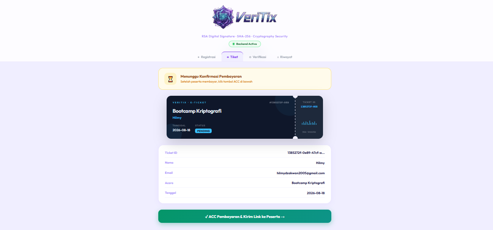
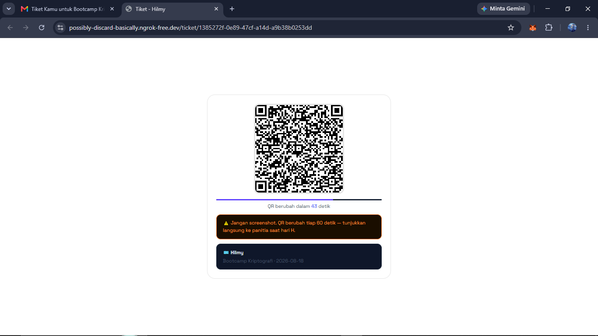
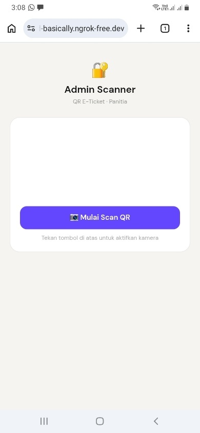
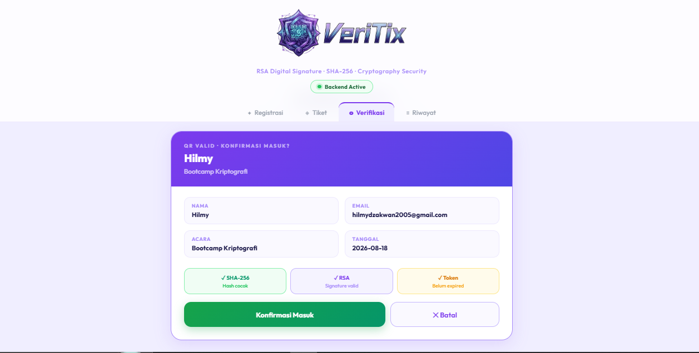
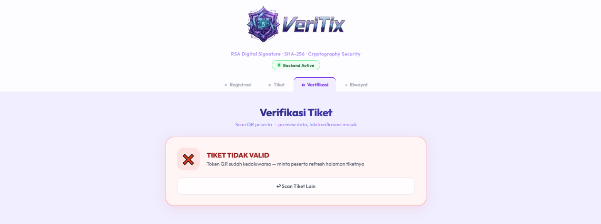
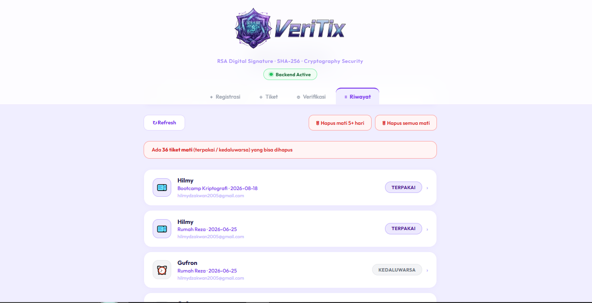
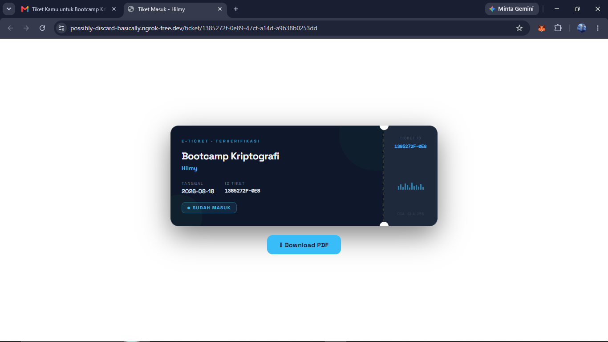

<div align="center">


# VeriTix: Forgery-Resistant QR E-Ticket System


</div>

---

VeriTix is a web-based e-ticket system built to prevent forgery, duplication, and tampering of digital tickets. Every ticket is protected with **RSA Digital Signature**, **SHA-256 hashing**, and a **dynamic QR Code** that refreshes every 60 seconds so it can't be reused from a screenshot.

This project was developed as the final project for the **Cryptography** course, Informatics Engineering, Bina Insani University (2026).

---

# Table of Contents

- [Overview](#overview)
- [Security Features](#security-features)
- [Demo](#demo)
- [Tech Stack](#tech-stack)
- [Project Structure](#project-structure)
- [How the System Works](#how-the-system-works)
- [Code Overview](#code-overview)
- [Environment Variables](#environment-variables)
- [Getting Started](#getting-started)
- [Usage Flow](#usage-flow)
- [Limitations](#limitations)
- [Future Development](#future-development)
- [License](#license)

---

# Overview

A digital ticket that is just a static QR Code is easy to copy, screenshot, or tamper with. VeriTix solves this by combining three layers of cryptographic protection at once: data integrity through hashing, issuer authenticity through digital signatures, and reuse prevention through a time-based dynamic token.

The system covers three roles: the **attendee** (registers and receives the ticket by email), the **committee** (approves payment and scans the QR on event day), and the **server** (generates, signs, and verifies every ticket in real time).

---

# Security Features

- **SHA-256**: generates a unique hash from each ticket's data, so any change to the data is immediately detectable.
- **RSA Digital Signature (2048-bit)**: the ticket hash is signed with the server's private key and verified with the public key during scanning, guaranteeing the ticket was only issued by the legitimate server.
- **Dynamic Time-Based Token**: the token embedded in the QR Code changes every 60 seconds, so a screenshotted or copied QR automatically expires and can't be reused.

---

# Demo

### 1. Attendee Registration
Attendees fill in their details and pick an available event.



### 2. Ticket Generation
On submit, the server creates a unique Ticket ID, computes a SHA-256 hash, and signs it with RSA.



### 3. Waiting for Payment Confirmation
Right after a ticket is generated, it sits in the Ticket tab with a "pending" status until the committee confirms the attendee has paid.



### 4. Dynamic QR Code
Once the committee approves the payment, attendees get a ticket page with a QR that refreshes every 60 seconds.



### 5. Admin Scanner
The committee opens the scanner page from a phone (via ngrok tunnel) to scan attendees' QR codes on event day.



### 6. Verification Result: Valid
If the hash matches, the RSA signature is valid, and the token hasn't expired, the committee can confirm entry.



### 7. Verification Result: Invalid
The system rejects tickets that aren't active yet, have expired, were already used, or have a mismatched signature.



### 8. Ticket History
The committee can search, review, and clean up all issued tickets, filterable by name, event, or email, with bulk deletion for used/expired tickets.



### 9. Post-Scan Ticket View
After a successful scan, the attendee refreshes their QR page. Since the ticket status is now `used`, the page swaps from the countdown QR view into a horizontal ticket card (with a downloadable PDF), confirming entry without exposing a reusable QR.



---

# Tech Stack

| Component | Technology |
|---|---|
| Frontend | React.js (Vite) |
| Backend | Node.js, Express.js |
| Database | SQLite (better-sqlite3) |
| Cryptography | node-forge (RSA + SHA-256) |
| Email | Nodemailer |
| QR Code | qrcode, qrcodejs, jsQR, ZXing |
| Tunneling | ngrok |

---

# Project Structure

```
qr-eticket/
├── backend/
│   ├── server.js
│   ├── package.json
│   └── .env.example        # copy to .env and fill in your own values
├── frontend/
│   ├── src/
│   │   ├── App.jsx
│   │   ├── main.jsx
│   │   └── index.css
│   ├── index.html
│   ├── vite.config.js
│   └── package.json
├── docs/                     # README screenshots & assets
└── README.md
```

> **Note:** `backend/.env`, `backend/rsa-keys.json` (RSA private key), and `backend/tickets.db` (attendee data) are **not** included in this repo since they contain sensitive data.

---

# How the System Works

1. An attendee submits the registration form. The server generates a unique Ticket ID (UUID).
2. The server computes a **SHA-256** hash of the ticket data.
3. The hash is signed with the **RSA private key**, producing a digital signature.
4. The ticket sits as `pending` in the committee's Ticket tab until payment is confirmed.
5. The committee approves the payment. The ticket status becomes `active`, and a QR link is automatically emailed to the attendee.
6. The ticket page renders a QR Code containing the hash, signature, and a **dynamic token** that changes every 60 seconds.
7. On scan, the server re-verifies the hash, RSA signature, and token validity before marking the ticket as `used`.
8. When the attendee refreshes their ticket page afterward, the server detects the `used` status and renders a static "already checked in" ticket view instead of a fresh QR, so no reusable QR is ever shown again.

---

# Code Overview

### `backend/server.js`
The Express server that owns all cryptography and business logic:

- **Key management**: generates an RSA-2048 key pair on first run (`rsa-keys.json`) or loads it if it already exists.
- **`POST /generate`**: creates a ticket, computes its SHA-256 hash, and signs it with the RSA private key.
- **`POST /approve/:id`**: activates a ticket and emails the attendee a link to their dynamic QR page via Nodemailer.
- **`GET /ticket/:id`**: renders the attendee-facing ticket page. Shows the self-refreshing QR Code (token regenerates every 60s client-side) while `pending`/`active`, but switches to a static "checked in" ticket card once the status is `used`.
- **`GET /admin`**: renders the committee-facing scanner page (uses the ZXing library to read QR codes from the phone camera).
- **`POST /preview`** and **`POST /verify`**: re-validate the hash, RSA signature, and dynamic token server-side. `/verify` additionally flips the ticket status to `used`.
- **`GET /tickets`**, **`DELETE /tickets/dead`**: ticket history listing and cleanup of used/expired tickets.

### `frontend/src/App.jsx`
The React SPA used by both the committee (registration, approval, history) and the verification flow:

- **Tabbed interface**: `register`, `ticket`, `verify`, `history`, each rendering conditionally based on the `tab` state.
- **Event manager**: lets the committee add/remove event names (persisted in `localStorage`) that populate the registration dropdown.
- **`handleGenerate` / `handleApprove`**: call the backend's `/generate` and `/approve/:id` endpoints. A ticket stays on the `ticket` tab showing a pending state until `handleApprove` is triggered.
- **Verification polling**: while on the `verify` tab, the app polls `GET /scan-result` every 2 seconds to pick up QR data scanned from the `/admin` page on a separate device, then calls `/preview` for a two-step confirm-before-verify flow.
- **`TicketCard`**: a reusable ticket UI component with a per-event color theme derived by hashing the event name.

---

# Environment Variables

Create a `backend/.env` file (see `backend/.env.example`) with:

```env
GMAIL_USER=your_sender_email@gmail.com
GMAIL_PASS=your_gmail_app_password
BASE_URL=http://localhost:3001
```

- `GMAIL_PASS` uses a Gmail **App Password**, not your regular account password. Create one at [myaccount.google.com/apppasswords](https://myaccount.google.com/apppasswords).
- The RSA key pair (`rsa-keys.json`) is generated automatically by the backend on first run if it doesn't already exist.

---

# Getting Started

You'll need **3 terminals** running at the same time.

**1. Install dependencies**

```bash
cd backend && npm install
cd ../frontend && npm install
```

**2. Start the backend (Terminal 1)**

```bash
cd backend
node server.js
```
Success looks like: `✓ Backend running at http://localhost:3001`

**3. Start the frontend (Terminal 2)**

```bash
cd frontend
npm run dev -- --host
```
Success looks like: `➜ Local: http://localhost:5173/`

**4. Start ngrok (Terminal 3)**, needed so the admin scanner page is reachable from a phone camera

```bash
ngrok config add-authtoken <YOUR_AUTHTOKEN>
ngrok http 3001
```
Copy the `Forwarding` URL shown, then open `<url>/admin` on a phone to scan.

> Get a free authtoken at [dashboard.ngrok.com](https://dashboard.ngrok.com)

---

# Usage Flow

1. Open `http://localhost:5173` in a browser, add an event, then register an attendee.
2. The new ticket appears as "pending" in the Ticket tab, waiting for payment confirmation.
3. The committee clicks **"Approve & Send QR Link"** once payment is confirmed.
4. The attendee opens their email and clicks **"Open My QR Ticket"**.
5. The committee opens `<ngrok-url>/admin` on a phone to scan the attendee's QR.
6. The system verifies the SHA-256 hash, RSA signature, and time token in real time.
7. If valid, the ticket is marked `used` and the attendee is let in.
8. If the attendee refreshes their ticket page after being scanned, it now shows a static "checked in" ticket instead of a QR code.

---

# Limitations

- No login/authentication on the admin page: anyone with the `/admin` URL can access the scanner.
- Backend and frontend communication is still plain HTTP (ngrok provides HTTPS at the tunnel level, but it's not end-to-end).
- No support yet for managing multiple concurrent events from a single dashboard.

# Future Development

- Login/authentication for committee/admin access.
- Export ticket data to Excel/PDF for reporting.
- Multi-event dashboard.
- Move from ngrok to a permanent domain/HTTPS setup for production deployment.

---

# License

This project is licensed under the [MIT License](LICENSE).

<div align="center">

Developed by **Muhammad Hilmy Aldzakwan**
GitHub: [github.com/hilmydzakwan](https://github.com/hilmydzakwan)

</div>
